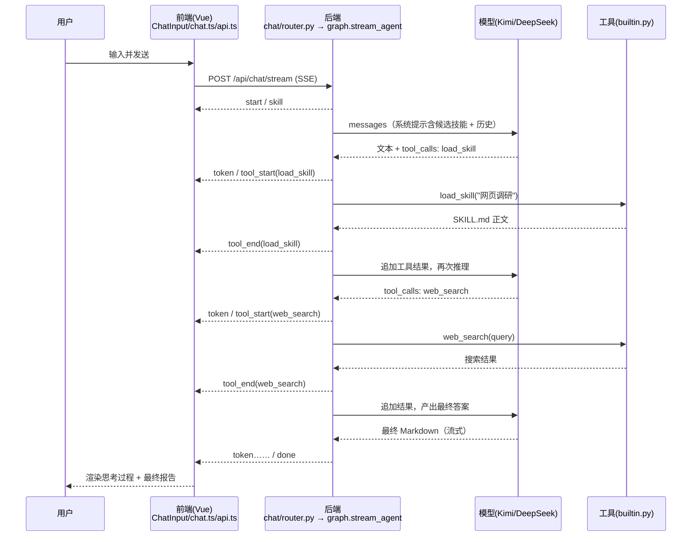

# 办公智能体 · ReAct 流程说明

> 从「用户输入」到「最终结果输出」，本项目在方法级别是如何相互流转的。
> 每一步都标注了所属文件与方法名，并在最后用一个完整例子呈现模型的输入 / 输出。

---

## 一、总览

技术栈：前端 **Vue 3 + Pinia**，后端 **FastAPI + LangGraph**，两端通过一条 **SSE（Server-Sent Events）流式接口** `POST /api/chat/stream` 通信。

核心思想是 **ReAct（Reason + Act）**：模型先思考，再决定是否调用工具（联网搜索 / 运行 Python / 加载技能 / 读写文件 / MCP 等），拿到工具结果后继续推理，如此循环，直到给出最终答案。整个过程通过 SSE 事件实时推送给前端，在「思考过程」面板逐步展示。

```
用户输入
  │  (Vue) ChatInput.send → chat.sendMessage → api.streamChat[POST SSE]
  ▼
后端 /api/chat/stream
  │  chat_stream → stream_agent
  │      ├─ 组装系统提示（注入用户选定的候选技能）
  │      ├─ 选择工具（内置 + MCP）
  │      ├─ 按模型名路由供应商（DeepSeek / Kimi）
  │      └─ create_react_agent + astream_events 循环
  │             ├─ 模型输出文本  → SSE: token
  │             ├─ 模型决定调工具 → SSE: tool_start
  │             └─ 工具返回结果  → SSE: tool_end
  ▼
前端逐事件更新
  │  streamChat.onEvent → chat.ts 拼装 ReAct steps
  ▼
渲染：MessageBubble + ReasoningTrace（思考 / 工具调用 / 最终回答）
```

---

## 二、方法级流转（从输入到输出）

### 阶段 1：前端发起请求

| 步骤 | 文件 | 方法 | 说明 |
|------|------|------|------|
| 1 | `frontend/src/components/ChatInput.vue` | `send()` | 用户点发送/回车，取输入框文本，调用 store |
| 2 | `frontend/src/stores/chat.ts` | `sendMessage(content)` | 组装历史消息、把用户消息与「助手占位消息」推入响应式会话、快照当前选中技能，然后发起流式请求 |
| 3 | `frontend/src/lib/api.ts` | `streamChat(req, onEvent)` | `fetch` `POST /api/chat/stream`，读取 `ReadableStream`，按 `\n\n` 切分 SSE，逐条 `JSON.parse` 后回调 `onEvent` |

`sendMessage` 发给后端的请求体（`ChatStreamRequest`）：

```json
{
  "messages": [{ "role": "user", "content": "……" }],
  "skills":   [{ "id": "web-research", "name": "网页调研" }],
  "web_search": true,
  "model": "moonshot-v1-8k"
}
```

> 注意：技能只传 `{id, name}`（候选集），完整指令由后端按需加载，不在前端传输。

### 阶段 2：后端接收与编排

| 步骤 | 文件 | 方法 | 说明 |
|------|------|------|------|
| 4 | `backend/app/chat/router.py` | `chat_stream(req)` | 返回 `StreamingResponse(stream_agent(req), media_type="text/event-stream")` |
| 5 | `backend/app/agent/graph.py` | `stream_agent(req)` | 编排主流程（下面细分） |
| 5.1 | `backend/app/agent/graph.py` | `_build_system_prompt(req)` | 拼系统提示；若有候选技能，注入「技能名：描述」清单，并指示模型用 `load_skill` 读取完整指令 |
| 5.2 | `backend/app/agent/graph.py` | `_select_builtin_tools(req)` | 从 `ALL_BUILTIN_TOOLS` 选工具；`web_search` 未开启则剔除 |
| 5.3 | `backend/app/mcp/manager.py` | `get_mcp_tools()` | 读取 MCP 配置，动态加载已启用 Server 的工具 |
| 5.4 | `backend/app/agent/llm.py` | `make_llm(model)` → `_resolve(model)` | 按模型名路由到 DeepSeek / Kimi 的接口与密钥，返回 `ChatOpenAI` |
| 5.5 | `langgraph.prebuilt` | `create_react_agent(llm, tools)` | 构建 ReAct 智能体图（agent 节点 ⇄ tools 节点循环） |
| 5.6 | `backend/app/agent/graph.py` | `_to_lc_messages(req)` | 把系统提示 + 历史消息转成 LangChain 消息对象 |
| 5.7 | `backend/app/agent/graph.py` | `stream_agent` 内 `agent.astream_events(..., version="v2")` | 逐事件消费图的运行，转成 SSE |
| 5.8 | `backend/app/sse.py` | `sse_event(type, **data)` | 把事件序列化成 `data: {json}\n\n` |

**ReAct 循环发生在 5.7**。`create_react_agent` 内部是一个状态图：

```
agent 节点（调用 LLM）
   │
   ├─ 模型返回 tool_calls ？
   │       是 → tools 节点（执行工具）→ 结果回填 → 回到 agent 节点
   │       否 → 结束，输出最终回答
```

`astream_events` 把这个循环里的底层事件抛出来，`stream_agent` 关心其中三类并转成 SSE：

- `on_chat_model_stream` → `sse_event("token", content=…)`（模型输出的文本增量）
- `on_tool_start` → `sse_event("tool_start", id, tool, args)`（开始调用某工具）
- `on_tool_end` → `sse_event("tool_end", id, tool, result)`（工具返回结果）

### 阶段 3：工具执行

模型决定调哪个工具后，LangGraph 的 tools 节点会调用 `backend/app/tools/builtin.py` 里对应的 `@tool` 函数：

| 工具 | 方法（`tools/builtin.py`） | 作用 |
|------|------|------|
| 联网搜索 | `web_search(query)` | 调 Tavily 返回结果 |
| 运行 Python | `run_python(code, file)` | 执行代码或 .py 文件 |
| 加载技能 | `load_skill(name)` | 读取技能的 SKILL.md 正文 + 附带文件路径 |
| 读/写/浏览 | `read_file` / `write_file` / `list_dir` | 本机文件操作 |
| 网页抓取 | `http_fetch(url)` | 相当于 curl |
| 执行命令 | `exec_command(command)` | 本机 shell |

其中 `load_skill` 会回到技能存储：`backend/app/skills/store.py` 的 `skill_bundle_by_ref(id_or_name)` → `find_detail()` 解析 `data/skills/<id>/SKILL.md` 的 frontmatter 与正文。

### 阶段 4：前端逐事件渲染

回到 `frontend/src/stores/chat.ts` 的 `sendMessage` 内 `streamChat` 的 `onEvent` 回调（作用在数组里的**响应式**助手消息 `ai` 上）：

| 事件 | 处理 | 效果 |
|------|------|------|
| `skill` | `ai.skills = names` | 顶部展示本轮启用的技能徽章 |
| `token` | `liveText += content; ai.content = liveText` | 流式文字逐字显示 |
| `tool_start` | `commitReasoning()`（把工具调用前累积的文字沉淀为一条「思考」step）→ 再 push 一条 `tool` step（`status: running`） | ReAct 面板新增一步 |
| `tool_end` | 找到对应 `tool` step，写入 `result`、`status: done` | 该步骤显示结果、变成完成态 |
| `error` | 追加到 `ai.content` | 显示错误提示 |

渲染组件链：

- `frontend/src/components/MessageList.vue`：`watch` 消息长度/内容自动滚动到底
- `frontend/src/components/MessageBubble.vue`：用户消息=右侧灰气泡；助手消息=左侧头像 + `markdown-it` 渲染正文；顶部技能徽章
- `frontend/src/components/ReasoningTrace.vue`：把 `steps` 渲染成可折叠的「思考过程」——`reasoning` 显示思考文本，`tool` 显示工具图标+参数摘要+可展开的完整参数/结果（`web_search`/`run_python`/`load_skill` 等各有中文标签与图标）

---

## 三、SSE 事件协议

每条形如 `data: <json>\n\n`，`json.type` 取值：

| type | 字段 | 含义 |
|------|------|------|
| `start` | — | 开始 |
| `skill` | `names` | 本轮启用的技能名 |
| `token` | `content` | 模型输出文本增量 |
| `tool_start` | `id, tool, args` | 开始调用工具 |
| `tool_end` | `id, tool, result` | 工具返回结果 |
| `error` | `message` | 出错 |
| `done` | — | 结束 |

前端还原 ReAct 的关键约定：**工具调用前累积的文本 = 一条“思考”，最后一段文本 = 最终回答**。

---

## 四、关键例子：模型的输入与输出

**场景**：用户在右侧选中「网页调研」技能，输入：

> 调研一下 2026 年智能家电市场的主要趋势

下面展示这一轮里，后端发给模型的 **输入（messages）** 和模型的 **输出**，以及对应的 SSE 事件。

### 轮次 1 —— 模型判断该用哪个技能

**模型输入**（`_to_lc_messages` 组装，经 `make_llm` 送往 Kimi）：

```json
[
  { "role": "system", "content":
    "你是「办公智能体」……（BASE_SYSTEM_PROMPT）\n\n用户为本次对话选定了以下候选技能，请根据用户的问题判断使用其中哪个……选定后先调用 load_skill(\"技能名\") 读取其完整指令，再严格按指令执行：\n- 网页调研：给定主题联网搜索并抓取网页，产出带来源的结构化调研报告。当用户要做市场/竞品/资料调研时使用。" },
  { "role": "user", "content": "调研一下 2026 年智能家电市场的主要趋势" }
]
```

**模型输出**（决定加载技能）：

```json
{
  "content": "这是一个调研任务，我先加载「网页调研」技能了解标准流程。",
  "tool_calls": [
    { "name": "load_skill", "args": { "name": "网页调研" } }
  ]
}
```

→ 对应 SSE：`token`（那句说明）、`tool_start {tool:"load_skill", args:{name:"网页调研"}}`

**工具返回**（`load_skill` → `store.skill_bundle_by_ref`）：

```
# 技能：网页调研
你是调研分析专家。
## 步骤
1. 用 web_search 搜索主题，挑选 3-5 个高质量来源
2. 必要时用 http_fetch 抓取重点网页正文
3. 汇总为结构化报告：概述 / 关键发现 / 建议
## 要求
每个关键结论后标注来源链接，确保可溯源。
建议使用的工具：web_search, http_fetch
```

→ 对应 SSE：`tool_end {tool:"load_skill", result:"# 技能：网页调研……"}`

### 轮次 2 —— 按技能指令联网搜索

**模型输入**（在轮次 1 基础上追加了 AI 的 tool_calls 与工具结果）：

```json
[
  { "role": "system",   "content": "……（同上）" },
  { "role": "user",      "content": "调研一下 2026 年智能家电市场的主要趋势" },
  { "role": "assistant", "content": "……", "tool_calls": [{ "name": "load_skill", "args": { "name": "网页调研" } }] },
  { "role": "tool",      "content": "# 技能：网页调研……（SKILL.md 正文）" }
]
```

**模型输出**（按技能流程发起搜索）：

```json
{
  "content": "开始联网搜索该主题的最新资料。",
  "tool_calls": [
    { "name": "web_search", "args": { "query": "2026 智能家电 市场 趋势" } }
  ]
}
```

→ SSE：`token`、`tool_start {tool:"web_search", args:{query:"2026 智能家电 市场 趋势"}}`

**工具返回**（`web_search` → Tavily）：

```
摘要：2026 年智能家电市场呈现 AI 化、全屋互联、能效升级三大趋势……
1. <标题> https://example.com/a  <摘要片段>
2. <标题> https://example.com/b  <摘要片段>
……
```

→ SSE：`tool_end {tool:"web_search", result:"摘要：……"}`

### 轮次 3 —— 产出最终报告

**模型输入**：在轮次 2 基础上再追加 web_search 的 tool 结果。

**模型输出**（无 tool_calls，纯文本 = 最终答案，流式返回）：

```markdown
## 2026 年智能家电市场主要趋势

### 概述
2026 年智能家电市场进入「AI 原生」阶段……

### 关键发现
1. **大模型上机** —— 家电内置本地/云端大模型……（来源：https://example.com/a）
2. **全屋互联** —— Matter 协议普及，跨品牌联动……（来源：https://example.com/b）
3. **能效与健康** —— ……

### 建议
- ……
```

→ SSE：多条 `token`（逐字流式）→ 最后 `done`

### 前端最终呈现

「思考过程」面板按顺序显示：

1. 💭 思考：这是一个调研任务，我先加载「网页调研」技能…
2. ✨ 加载技能 · 网页调研　（可展开看 SKILL.md 正文）
3. 💭 思考：开始联网搜索该主题的最新资料。
4. 🔍 联网搜索 · "2026 智能家电 市场 趋势"　（可展开看搜索结果）

面板下方即最终的 Markdown 调研报告。

---

## 五、时序图



---

## 六、关键文件速查

| 层 | 文件 | 职责 |
|----|------|------|
| 前端 | `frontend/src/components/ChatInput.vue` | 发送入口 |
| 前端 | `frontend/src/stores/chat.ts` | 会话状态、SSE 事件拼装 ReAct steps |
| 前端 | `frontend/src/lib/api.ts` | `streamChat` 解析 SSE |
| 前端 | `frontend/src/components/ReasoningTrace.vue` | 思考过程可视化 |
| 后端 | `backend/app/chat/router.py` | SSE 接口入口 |
| 后端 | `backend/app/agent/graph.py` | ReAct 编排、事件转 SSE |
| 后端 | `backend/app/agent/llm.py` | 供应商路由（DeepSeek/Kimi） |
| 后端 | `backend/app/tools/builtin.py` | 内置工具实现 |
| 后端 | `backend/app/skills/store.py` | SKILL.md 技能注册表 |
| 后端 | `backend/app/mcp/manager.py` | MCP 工具动态加载 |
| 后端 | `backend/app/sse.py` | SSE 事件序列化 |
